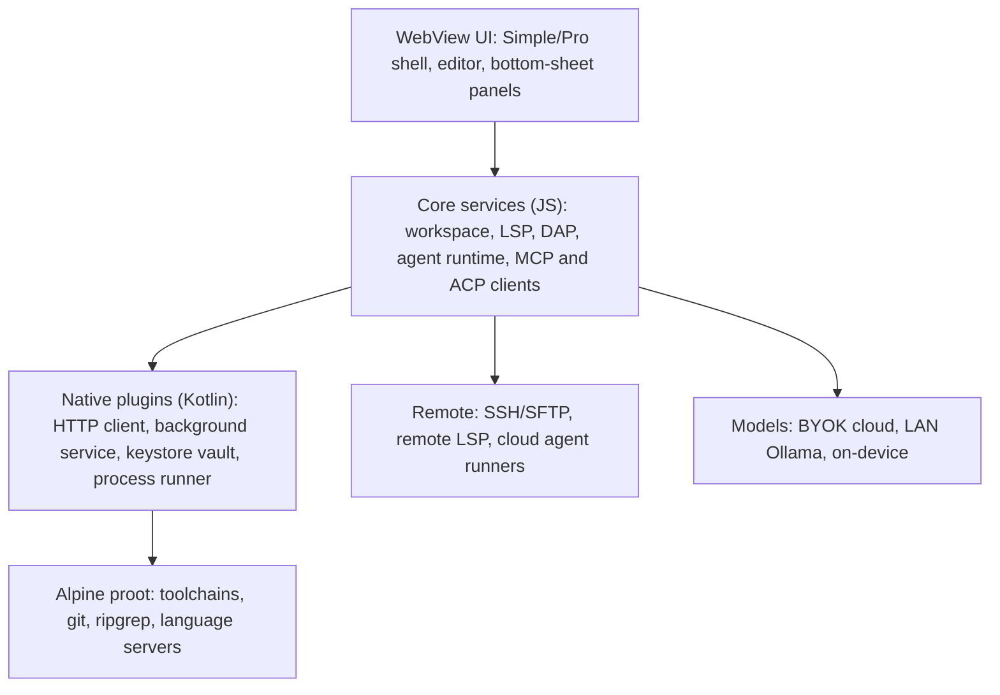

# Project Bract: Blueprint v0.1

*A calm, beginner-friendly, agent-first full local IDE for Android, forked from Acode. Draft, Sept 2026. Rough estimates are marked as such.*

## 1. Vision and principles

**Vision:** a calm phone IDE that a first-timer can use in minutes and a professional can trust for real work, with a supervised AI agent built in.

**Users:** (1) phone-only beginners and students, (2) hobbyists and developers coding on the go, (3) power users who pair the phone with a remote server.

**Principles**
1. **Calm by default, powerful on demand.** Progressive disclosure; Simple mode first.
2. **Thumb-first.** Core actions are one-handed. Panels are bottom sheets, not side docks.
3. **Agent as a teammate you supervise,** not a chat box.
4. **Two dials, not one switch.** Privacy and autonomy are independent settings.
5. **Compatible.** Keep the Acode plugin API and stay mergeable with upstream.
6. **Local-first.** Works offline; cloud features are opt-in.
7. **Measurable.** Every feature ships with an acceptance test and a metric.

## 2. Baseline: what Acode already gives us

| Area | Acode today (from repo research) | Fork action |
|---|---|---|
| Shell | Cordova hybrid app | Keep |
| Editor | CodeMirror (migrated from Ace) | Keep, tune for mobile |
| LSP | Built in, per-server settings, externally managed WebSocket servers | Extend: manager UI, one-tap server install |
| Terminal | Alpine Linux in proot, shared public folder | Harden; background service |
| Remote | SFTP plus SSH terminal integration | Extend to full remote workspaces |
| Git | Community plugin driving the native git binary; needs manual `apk add git` and OpenSSH | Bundle, add native UI |
| AI | Community agent plugin (file and terminal tools; Gemini, OpenRouter, Ollama, OpenAI; Ollama needs a CORS proxy) | Replace with a native core |
| Plugins | Large community catalog | Keep API compatibility |
| Build | pnpm/bun, nightly builds, unit tests in CI, free/paid and F-Droid flavors | Reuse |

**Verify before committing** (could not confirm from public pages): built-in debugger, test runner, split view, project-wide search depth, exact LICENSE terms, and current store policy for executing downloaded binaries.

## 3. Fork strategy

- Forked as `ShashiDao/Bract` from `Acode-Foundation/Acode` (main branch only). Track upstream with a scheduled weekly merge or rebase from `main`/nightlies.
- Put new code under `src/pocket/` (or equivalent feature-flagged modules) and expose it through feature flags (`simple_mode`, `agent`, `dap`, `remote`). Keep edits to upstream files small and listed in `PATCHES.md`.
- Send generic fixes upstream first; keep only product-specific code in the fork.
- New app name, icon, and package ID (see `docs/DECISIONS.md`). Keep license notices and attribution intact.
- Plugin API is additive-only. CI runs contract tests against the most popular community plugins.
- Channels: nightly, beta, stable. Distribution: GitHub APK and F-Droid first; Play Store after a policy review (see Risks).

## 4. Architecture

**Native plugin responsibilities**
- **HTTP client:** all model and network calls bypass WebView CORS, stream responses, and support cancellation.
- **Background service:** foreground service for agent runs, dev servers, and long builds, with a visible notification and one-tap stop.
- **Vault:** API keys, tokens, and SSH keys in Android Keystore-backed storage; never in plain settings.
- **Process runner:** structured command execution in proot with timeouts, output streaming, and exit codes for the agent.

**Workspace model:** projects live in app-private storage (fast, git-friendly). Import and export through the Android file picker, with an optional "linked folder" mode that syncs to a chosen folder. This avoids slow, quirky SAF access in the hot path.

## 5. Feature specifications

### 5.1 Simple and Pro modes
- **Goal:** less clutter without losing power.
- **Simple mode UI:** top bar (project name, Run, Undo/Redo, More); bottom context-aware extra-key row; one Assistant button; file tree, search, and Git in a left drawer; tabs collapse into a recent-files switcher; Terminal, Problems, Preview, Debug open as bottom sheets (peek, half, full).
- **Command palette:** one search box for files, commands, symbols, and settings.
- **Settings:** five groups (Editor, Appearance, Run and Tools, AI and Privacy, Advanced), searchable. Pro mode reveals advanced items and the full tab bar.
- **Acceptance:** a new user opens a template and sees it run in under 60 seconds; Pro toggle needs no restart.

### 5.2 Onboarding and templates
- 3-screen first run: pick a goal (website, Python, Node, other), pick a theme and font size, optionally enable AI.
- Templates: static site, Python script, Node/Vite app, Flask/Express API, "empty". Each includes a Run task, a README, and a starter AGENTS.md.
- Guided first edit with plain-language hints; dismissible and re-openable.
- **Acceptance:** 80% of test users complete "edit and preview" unaided in usability tests.

### 5.3 Agent core
**Loop:** plan, gather context, edit as a patch set, verify (diagnostics, tests, preview), summarize. Step, time, and token budgets end every run.

**Tools (v1)**

| Tool | Notes |
|---|---|
| `fs.read/list/search` | ripgrep-backed; workspace-scoped |
| `fs.patch` | hunk edits with context matching; conflicts surface as review items |
| `fs.create/rename/delete` | delete always confirms |
| `shell.run` | proot; allow/deny patterns; timeout; streamed output |
| `lsp.diagnostics/definition/references` | real compiler feedback |
| `git.status/diff/commit/checkpoint/rollback` | checkpoint before every run |
| `preview.screenshot/console` | lets the agent see what it built |
| `web.fetch/search` | gated by the privacy level |
| `mcp.*` | dynamic tools from connected MCP servers |
| `debug.*`, `test.run` | added in Phase 2 |

**Context:** a repo map (symbols via LSP or tree-sitter), project instructions from `AGENTS.md`, ripgrep retrieval, rolling summaries for long tasks.

**Where it runs:** on-device as a foreground service, or on a remote runner (SSH or ACP) for long jobs so phone battery and background limits do not matter.

**Models:** bring your own key for any provider; native streaming; LAN Ollama; optional on-device small model where hardware allows. A routing policy sends small edits to cheap models and planning to the strongest. A cost estimate and cap are shown before each run.

**Protocols:** MCP client for tools. ACP client so external coding agents can drive the editor (local subprocess in proot, or remote).

**Review UX:** task card with timeline; swipe to accept or reject each hunk; approvals as notifications; voice and screenshot prompts; one-tap rollback to the run's checkpoint.

### 5.4 Privacy and autonomy dials

| Privacy level | What can leave the device | Model location | Default |
|---|---|---|---|
| **L0 Local** | Nothing (LAN allowed) | On-device or your own Ollama | n/a |
| **L1 Cloud, scoped** | Your prompt and only files the agent opens; secrets redacted | BYOK cloud | Yes, when AI is enabled |
| **L2 Full cloud ("zero privacy")** | Whole-project index, terminal output, diagnostics, screenshots, web access; optional trace sharing to improve results | Strongest cloud model | Opt-in per project, consent screen |

| Autonomy level | Behavior |
|---|---|
| **A0 Ask** | Confirm every tool call |
| **A1 Auto-edit** | Auto-read and auto-edit inside the workspace; confirm shell, network, delete |
| **A2 Autopilot** | Everything inside the sandbox and budget; hard stops remain |

**Always on, at every level:** checkpoint before runs; workspace-scoped paths; hard denylist (force-push, deleting outside the workspace, credential exfiltration). At L2, secrets stay blocked unless overridden per project with a typed confirmation, because leaked keys are irreversible and do not improve answers.

### 5.5 Run, toolchains, tasks
- **Runtimes manager:** one-tap install and switch for Python, Node, Java, Go, and others, with disk-usage display and cleanup.
- **Run tasks:** auto-detected from project files (`package.json`, `pyproject.toml`, and so on), editable in `.pocket/tasks.json`, with a big Run button.
- **Dev servers:** survive backgrounding via the foreground service; port list with open-in-preview.
- **Acceptance:** fresh install to a running Python or Node hello-world without typing in the terminal.

### 5.6 Debugger (DAP)
- Debug Adapter Protocol client: breakpoints (line, conditional), step controls, call stack, variables, watch, and debug console in a bottom sheet.
- v1 adapters: JavaScript/Node and Python (debugpy); more via adapter packs.
- Exposed to the agent as `debug.*` tools.

### 5.7 Problems, tests, navigation, search
- **Problems panel:** project-wide diagnostics from LSP, tap to jump.
- **Test explorer:** discover and run tests (pytest, Jest/Vitest first), per-test pass/fail, rerun failed.
- **Navigation:** go to definition, find references, rename symbol, outline, breadcrumbs.
- **Search:** project-wide search and replace with regex and a preview of changes before applying.

### 5.8 Git, built in
- Bundled git and OpenSSH; no terminal setup.
- Save / Sync / History screens for beginners; Pro adds staging by hunk, branches, stash, blame.
- Side-by-side and inline diff; conflict resolver optimized for touch.
- Sign in with GitHub and GitLab; in-app SSH key generation; PR list and create.

### 5.9 Preview and deploy
- Live preview with hot reload, device-size toggles, and an inspector (elements, console, network).
- One-tap publish and share to GitHub Pages, Netlify, or Cloudflare Pages (user's own account).

### 5.10 Remote workspaces
- Open a folder over SSH as a first-class workspace: remote file tree, remote terminal, remote LSP through the existing WebSocket route.
- Optional cloud dev environments as a later connector.
- Agent can run against the remote workspace.

### 5.11 Large screens and keyboards
- Split view and multi-window for tablets, foldables, and desktop mode.
- VS Code keymap preset; mouse and trackpad support; full shortcut editor.

### 5.12 Safety net
- Per-file local history and timeline; project backup and restore; zip import/export.
- Encrypted vault (Keystore) for tokens and keys, with per-project access.

### 5.13 VS Code import
- Convert themes, snippets, and keybindings. Extensions are out of scope for v1.

## 6. Security model
- **Untrusted content:** files, READMEs, web pages, and tool output are data, never instructions. Content cannot raise its own permissions.
- **Fresh clones:** never auto-run scripts from a newly cloned repo; show what will run first.
- **Plugins:** declare permissions (files, network, terminal, vault); user-visible on install; signed and versioned catalog with "Recommended" badges.
- **Consent and disclosure:** explicit screens for L1 and L2, per-project overrides, an activity log of what was sent, and accurate store data-safety declarations.
- **Network:** per-provider allowlist; TLS only; no analytics without opt-in.

## 7. Android platform notes
- Edge-to-edge layouts, predictive back, and window-size-aware layouts from day one.
- Foreground-service types and notifications for long tasks; test on aggressive-battery OEMs.
- Keep proot binaries and any bundled native libraries compatible with current store and OS requirements; verify target-API and native-library rules at build time.
- Target mid-range devices for performance budgets, not flagships.

## 8. Roadmap (rough estimates for a 4 to 6 person team)

| Phase | Weeks | Scope | Exit criteria |
|---|---|---|---|
| 0 Setup | 2 | Fork, CI, rebrand, baseline audit, eval harness skeleton, decisions in section 11 | Builds and passes upstream tests |
| 1 Calm and Ready | 6 to 8 | Simple/Pro, onboarding, templates, bundled Git, native HTTP and vault, Agent v1 (chat, read/edit/run, diff review, checkpoints), dials v1 | Time-to-first-run under 90 s; agent passes its first eval targets |
| 2 Real IDE loop | 8 to 10 | Runtimes manager, run tasks, Problems, tests, navigation and search, preview inspector, DAP for JS and Python, agent uses debug and test tools | Debug a Node and a Python bug end to end on-device |
| 3 Everywhere | 8 | Remote workspaces, MCP and ACP, remote agent runners, large-screen layouts, VS Code import, deploy | Remote edit-run-agent loop works over SSH |
| 4 Launch | 4 to 6 | Beta, hardening, docs, plugin API v2, store submissions | Crash-free target met; beta feedback triaged |

## 9. Metrics and evals
- **Product:** time to first run (target under 90 s), day-7 retention, crash-free sessions (target 99.5%+), cold start (baseline first, then set a budget).
- **Agent eval suite (about 60 tasks):** bug fix, add feature, refactor, explain code, set up environment, UI tweak from screenshot. Track pass rate, steps, tokens and cost, wall time. Run nightly across providers; a regression blocks release.
- **Privacy:** audit log completeness; zero unexplained network calls in L0.

## 10. Risks and mitigations

| Risk | Mitigation |
|---|---|
| Upstream divergence | Namespace isolation, weekly merges, upstream-first fixes |
| Store policy on executing downloaded binaries | Review policy early; ship toolchain features via F-Droid/GitHub if needed |
| Android background limits kill long tasks | Foreground service, remote runners, resumable runs |
| Prompt injection via repo or web content | Section 6 rules; confirmations for shell and network |
| WebView performance on low-end phones | Lazy-load language packs and servers; budgets in CI |
| Agent cost blowups | Budgets, pre-run estimates, cheap-model routing |
| proot fragility across devices | Device test matrix; fallback to remote runner |

## 11. Decisions needed
1. Verify the Acode LICENSE and finalize package ID.
2. Choose distribution channels and monetization (Acode already has free and paid flavors).
3. Set team size and target device floor (Android version, RAM).
4. Pick the first three model providers to support and test.

Resolved: name (Bract, see `docs/DECISIONS.md` ADR-002); fork approach (native GitHub fork, ADR-001); "zero privacy" meaning (section 5.4, L2 — full-cloud opt-in with secrets still blocked by default).

## 12. Research notes
Based on public pages reviewed in Sept 2026: `github.com/Acode-Foundation/Acode` (README, releases, PRs), `github.com/Acode-Foundation/acode-plugin-git`, `github.com/hallofcodes/acode-ai-agent-plugin`, and `agentclientprotocol.com`. Anything not confirmed there is listed under "Verify" in section 2.
