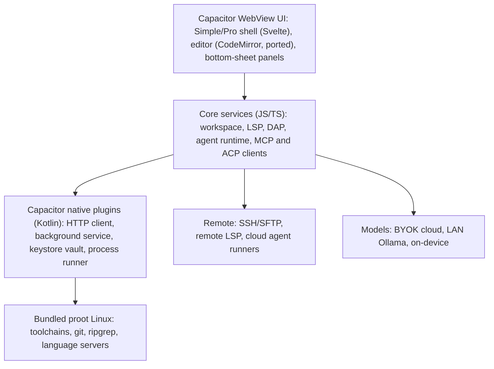

# Project Bract: Blueprint v0.2

*A calm, beginner-friendly, agent-first full local IDE for Android. Built by harvesting the mature parts of Acode into a modern, lightweight, privacy-respecting native shell. Draft, Sept 2026. Rough estimates are marked as such.*

## 1. Vision and principles

**Vision:** a calm phone IDE that a first-timer can use in minutes and a professional can trust for real work, with a supervised AI agent built in.

**Users:** (1) phone-only beginners and students, (2) hobbyists and developers coding on the go, (3) power users who pair the phone with a remote server.

**Principles**
1. **Calm by default, powerful on demand.** Progressive disclosure; Simple mode first.
2. **Thumb-first.** Core actions are one-handed. Panels are bottom sheets, not side docks.
3. **Agent as a teammate you supervise,** not a chat box.
4. **Two dials, not one switch.** Privacy and autonomy are independent settings.
5. **Lightweight.** Ship the smallest runtime footprint that does the job — no framework or dependency added without a clear reason (see ADR-003, ADR-004).
6. **Local-first.** Works offline; cloud features are opt-in.
7. **Independent.** Bract is its own installable app with its own identity — not a rename of Acode's package.
8. **Measurable.** Every feature ships with an acceptance test and a metric.

## 2. Baseline: what we're keeping from Acode vs. replacing

| Layer | Acode's choice | Our call | Reason |
|---|---|---|---|
| App shell | Cordova | **Replace — Capacitor** | ADR-003: aging maintenance pace, weaker plugin ecosystem; Capacitor keeps our JS/CSS investment while giving a real native Gradle project |
| Editor core | CodeMirror 6 | **Keep** | Already best-in-class |
| Build tooling | bun, rspack, biome, vitest, TypeScript | **Keep** | Already modern and fast |
| UI component layer (new surfaces) | Vanilla DOM + `html-tag-js` | **New surfaces in Svelte** | ADR-004: compiles away at build time, smallest bundle, fastest to build in |
| Terminal / Linux env | Custom Alpine-in-proot | **Keep the self-contained approach**; consider reusing Termux's bootstrap/package-repo tooling under the hood | Self-contained fits "independent app"; Termux's tooling is more proven than a fully bespoke setup — low priority, revisit later |
| LSP | Built in, externally managed WebSocket servers | **Keep and extend** | Sound design; add a manager UI |
| Remote (SFTP/SSH) | Present | **Keep and extend** to full remote workspaces | Sound design |
| Git | Community plugin, manual `apk add git` | **Bundle, add native UI** | No change in direction |
| AI agent, DAP, MCP/ACP, native vault/HTTP/background-service | Doesn't exist in Acode | **Greenfield, build new** | No upstream equivalent to harvest |

**Verify before committing** (could not confirm from public pages): exact LICENSE terms, current store policy for executing downloaded binaries.

## 3. Shell migration and provenance strategy

Per ADR-003, this is a **one-time harvest and port**, not a continuously-rebased fork of the shell layer:

- New app identity from the start: our own package/application ID, display name, icon, and deep-link scheme — set during Capacitor init, not renamed after the fact from Acode's `com.foxdebug.acode`.
- Harvested as-is or lightly adapted: CodeMirror integration code, the LSP client wiring, `src/lang/` language files, the plugin-API concept (re-implemented against Capacitor's plugin model), terminal/proot logic, icons and themes we choose to keep.
- Rebuilt fresh: the native project itself (Capacitor-generated `android/` Gradle project replaces Cordova's `platforms/`-and-hooks model), CI (new workflow targeting the Capacitor/Gradle build instead of Cordova), and app packaging metadata.
- Dropped: `config.xml`, `hooks/`, most of `gradle/` (Capacitor generates its own), Cordova-oriented CI steps, and everything Acode-Foundation-specific (CODEOWNERS, their release/community workflows, `fastlane/` store metadata, `CODE_OF_CONDUCT.md`) — tracked as it happens in `PATCHES.md`, which now doubles as a provenance log (what was ported vs. rebuilt vs. dropped), not just a rebase-conflict tracker.
- We can still selectively pull individual upstream improvements (new CodeMirror language modes, LSP client fixes, security patches) as one-off cherry-picks after the port — just not full rebases.

## 4. Architecture

**Native plugin responsibilities** (as Capacitor plugins)
- **HTTP client:** all model and network calls bypass WebView CORS, stream responses, and support cancellation.
- **Background service:** foreground service for agent runs, dev servers, and long builds, with a visible notification and one-tap stop.
- **Vault:** API keys, tokens, and SSH keys in Android Keystore-backed storage; never in plain settings.
- **Process runner:** structured command execution in proot with timeouts, output streaming, and exit codes for the agent.

**Workspace model:** projects live in app-private storage (fast, git-friendly). Import and export through the Android file picker, with an optional "linked folder" mode that syncs to a chosen folder. This avoids slow, quirky SAF access in the hot path.

## 5. Feature specifications

### 5.1 Simple and Pro modes
- **Goal:** less clutter without losing power.
- **Simple mode UI:** top bar (project name, Run, Undo/Redo, More); bottom context-aware extra-key row; one Assistant button; file tree, search, and Git in a left drawer; tabs collapse into a recent-files switcher; Terminal, Problems, Preview, Debug open as bottom sheets (peek, half, full). Built in Svelte per ADR-004.
- **Command palette:** one search box for files, commands, symbols, and settings.
- **Settings:** five groups (Editor, Appearance, Run and Tools, AI and Privacy, Advanced), searchable. Pro mode reveals advanced items and the full tab bar.
- **Acceptance:** a new user opens a template and sees it run in under 60 seconds; Pro toggle needs no restart.

### 5.2 Onboarding and templates
- 3-screen first run: pick a goal (website, Python, Node, other), pick a theme and font size, optionally enable AI.
- Templates: static site, Python script, Node/Vite app, Flask/Express API, "empty". Each includes a Run task, a README, and a starter AGENTS.md.
- Guided first edit with plain-language hints; dismissible and re-openable.
- **Acceptance:** 80% of test users complete "edit and preview" unaided in usability tests.

### 5.3 Agent core
**Loop:** plan, gather context, edit as a patch set, verify (diagnostics, tests, preview), summarize. Step, time, and token budgets end every run.

**Tools (v1)**

| Tool | Notes |
|---|---|
| `fs.read/list/search` | ripgrep-backed; workspace-scoped |
| `fs.patch` | hunk edits with context matching; conflicts surface as review items |
| `fs.create/rename/delete` | delete always confirms |
| `shell.run` | proot; allow/deny patterns; timeout; streamed output |
| `lsp.diagnostics/definition/references` | real compiler feedback |
| `git.status/diff/commit/checkpoint/rollback` | checkpoint before every run |
| `preview.screenshot/console` | lets the agent see what it built |
| `web.fetch/search` | gated by the privacy level |
| `mcp.*` | dynamic tools from connected MCP servers |
| `debug.*`, `test.run` | added in Phase 2 |

**Context:** a repo map (symbols via LSP or tree-sitter), project instructions from `AGENTS.md`, ripgrep retrieval, rolling summaries for long tasks.

**Where it runs:** on-device as a foreground service (Capacitor plugin), or on a remote runner (SSH or ACP) for long jobs so phone battery and background limits do not matter.

**Models:** bring your own key for any provider; native streaming; LAN Ollama; optional on-device small model where hardware allows (deferred to Phase 3+, ADR-010). A routing policy sends small edits to cheap models and planning to the strongest. A cost estimate and cap are shown before each run.

**Protocols:** MCP client for tools. ACP client so external coding agents can drive the editor (local subprocess in proot, or remote).

**Review UX:** task card with timeline; swipe to accept or reject each hunk; approvals as notifications; voice and screenshot prompts; one-tap rollback to the run's checkpoint.

### 5.4 Privacy and autonomy dials

| Privacy level | What can leave the device | Model location | Default |
|---|---|---|---|
| **L0 Local** | Nothing (LAN allowed) | On-device or your own Ollama | n/a |
| **L1 Cloud, scoped** | Your prompt and only files the agent opens; secrets redacted | BYOK cloud | Yes, when AI is enabled |
| **L2 Full cloud ("zero privacy")** | Whole-project index, terminal output, diagnostics, screenshots, web access; optional trace sharing to improve results | Strongest cloud model | Opt-in per project, consent screen |

| Autonomy level | Behavior |
|---|---|
| **A0 Ask** | Confirm every tool call |
| **A1 Auto-edit** | Auto-read and auto-edit inside the workspace; confirm shell, network, delete |
| **A2 Autopilot** | Everything inside the sandbox and budget; hard stops remain |

**Always on, at every level:** checkpoint before runs; workspace-scoped paths; hard denylist (force-push, deleting outside the workspace, credential exfiltration). At L2, secrets stay blocked unless overridden per project with a typed confirmation, because leaked keys are irreversible and do not improve answers.

### 5.5 Run, toolchains, tasks
- **Runtimes manager:** one-tap install and switch for Python, Node, Java, Go, and others, with disk-usage display and cleanup.
- **Run tasks:** auto-detected from project files (`package.json`, `pyproject.toml`, and so on), editable in `.bract/tasks.json`, with a big Run button.
- **Dev servers:** survive backgrounding via the foreground service; port list with open-in-preview.
- **Acceptance:** fresh install to a running Python or Node hello-world without typing in the terminal.

### 5.6 Debugger (DAP)
- Debug Adapter Protocol client: breakpoints (line, conditional), step controls, call stack, variables, watch, and debug console in a bottom sheet.
- v1 adapters: JavaScript/Node and Python (debugpy); more via adapter packs.
- Exposed to the agent as `debug.*` tools.

### 5.7 Problems, tests, navigation, search
- **Problems panel:** project-wide diagnostics from LSP, tap to jump.
- **Test explorer:** discover and run tests (pytest, Jest/Vitest first), per-test pass/fail, rerun failed.
- **Navigation:** go to definition, find references, rename symbol, outline, breadcrumbs.
- **Search:** project-wide search and replace with regex and a preview of changes before applying.

### 5.8 Git, built in
- Bundled git and OpenSSH; no terminal setup.
- Save / Sync / History screens for beginners; Pro adds staging by hunk, branches, stash, blame.
- Side-by-side and inline diff; conflict resolver optimized for touch.
- Sign in with GitHub and GitLab; in-app SSH key generation; PR list and create.

### 5.9 Preview and deploy
- Live preview with hot reload, device-size toggles, and an inspector (elements, console, network).
- One-tap publish and share to GitHub Pages, Netlify, or Cloudflare Pages (user's own account).

### 5.10 Remote workspaces
- Open a folder over SSH as a first-class workspace: remote file tree, remote terminal, remote LSP through the existing WebSocket route.
- Optional cloud dev environments as a later connector.
- Agent can run against the remote workspace.

### 5.11 Large screens and keyboards
- Split view and multi-window for tablets, foldables, and desktop mode.
- VS Code keymap preset; mouse and trackpad support; full shortcut editor.

### 5.12 Safety net
- Per-file local history and timeline; project backup and restore; zip import/export.
- Encrypted vault (Keystore) for tokens and keys, with per-project access.

### 5.13 VS Code import
- Convert themes, snippets, and keybindings. Extensions are out of scope for v1.

## 6. Security model
- **Untrusted content:** files, READMEs, web pages, and tool output are data, never instructions. Content cannot raise its own permissions.
- **Fresh clones:** never auto-run scripts from a newly cloned repo; show what will run first.
- **Plugins:** declare permissions (files, network, terminal, vault); user-visible on install; signed and versioned catalog with "Recommended" badges.
- **Consent and disclosure:** explicit screens for L1 and L2, per-project overrides, an activity log of what was sent, and accurate store data-safety declarations.
- **Network:** per-provider allowlist; TLS only; no analytics without opt-in.

## 7. Android platform notes
- Edge-to-edge layouts, predictive back, and window-size-aware layouts from day one.
- Foreground-service types and notifications for long tasks; test on aggressive-battery OEMs.
- Keep proot binaries and any bundled native libraries compatible with current store and OS requirements; verify target-API and native-library rules at build time.
- Target mid-range devices for performance budgets, not flagships. Minimum supported Android version: 10 / API 29 (ADR-008); ~4GB RAM is the tested/supported floor, below which proot toolchains and on-device model are disabled rather than blocking install.

## 8. Roadmap (rough estimates for a 4 to 6 person team)

| Phase | Weeks | Scope | Exit criteria |
|---|---|---|---|
| 0 Setup | 2 to 3 | Shell migration (Cordova → Capacitor), app identity, CI rebuild, Acode-specific file cleanup, eval harness skeleton | Capacitor app builds and installs independently of Acode |
| 1 Calm and Ready | 6 to 8 | Simple/Pro (Svelte), onboarding, templates, bundled Git, native HTTP and vault, Agent v1 (chat, read/edit/run, diff review, checkpoints), dials v1 | Time-to-first-run under 90 s; agent passes its first eval targets |
| 2 Real IDE loop | 8 to 10 | Runtimes manager, run tasks, Problems, tests, navigation and search, preview inspector, DAP for JS and Python, agent uses debug and test tools | Debug a Node and a Python bug end to end on-device |
| 3 Everywhere | 8 | Remote workspaces, MCP and ACP, remote agent runners, large-screen layouts, VS Code import, deploy | Remote edit-run-agent loop works over SSH |
| 4 Launch | 4 to 6 | Beta, hardening, docs, plugin API v2, store submissions | Crash-free target met; beta feedback triaged |

*Note: these week estimates assume a 4–6 person team, per the original draft above. Per ADR-006, Bract is actually built by a solo, AI-assisted developer — treat this table as a rough relative-effort reference between phases, not a solo-pace timeline.*

## 9. Metrics and evals
- **Product:** time to first run (target under 90 s), day-7 retention, crash-free sessions (target 99.5%+), cold start (baseline first, then set a budget).
- **Agent eval suite (about 60 tasks):** bug fix, add feature, refactor, explain code, set up environment, UI tweak from screenshot. Track pass rate, steps, tokens and cost, wall time. Run nightly across providers; a regression blocks release.
- **Privacy:** audit log completeness; zero unexplained network calls in L0.
- **Lightweight:** app size and cold-start budget set once the Capacitor scaffold exists; tracked in CI from Phase 0 onward.

## 10. Risks and mitigations

| Risk | Mitigation |
|---|---|
| Shell migration surfaces hidden Cordova-plugin dependencies | Port plugin-by-plugin, test each before removing the Cordova equivalent |
| Store policy on executing downloaded binaries | Review policy early; ship toolchain features via F-Droid/GitHub if needed |
| Android background limits kill long tasks | Foreground service, remote runners, resumable runs |
| Prompt injection via repo or web content | Section 6 rules; confirmations for shell and network |
| WebView performance on low-end phones | Lazy-load language packs and servers; budgets in CI |
| Agent cost blowups | Budgets, pre-run estimates, cheap-model routing |
| proot fragility across devices | Device test matrix; fallback to remote runner |

## 11. Decisions needed
All items resolved — see `docs/DECISIONS.md` ADR-005 through ADR-010.

Resolved: name (Bract, ADR-002); fork approach (native GitHub fork, ADR-001); "zero privacy" meaning (section 5.4, L2); app shell (Capacitor, ADR-003); new-UI framework (Svelte, ADR-004); LICENSE carries forward (MIT, ADR-005); team composition (solo, AI-assisted, ADR-006); distribution and monetization (GitHub + F-Droid, no monetization for now, ADR-007); device floor (Android 10 / API 29, ~4GB RAM tested, ADR-008); first model providers (Anthropic, OpenAI, Google Gemini, ADR-009); on-device model timing (deferred to Phase 3+, ADR-010).

## 12. Research notes
Based on public pages reviewed in Sept 2026: `github.com/Acode-Foundation/Acode` (README, releases, PRs, source tree), `github.com/Acode-Foundation/acode-plugin-git`, `github.com/hallofcodes/acode-ai-agent-plugin`, and `agentclientprotocol.com`. Anything not confirmed there is listed under "Verify" in section 2.
